# Sneaking a peek at the stock market:

In this project, the price of the stocks had been analyzed using python libraries. The help of EDA or extrapolatory data analysis has been taken in order to visualzie the data and to infer meaning out of them.

Below python libraries have been imported.

```python
import numpy as np
import pandas as pd
import seaborn as sns
import matplotlib.pyplot as plt
from pandas_datareader import data as wb
from __future__ import division
from pandas import Series,DataFrame
sns.set_style('whitegrid')
%matplotlib inline
```
**Creating Portfolio:**

The list of technical stocks have been choosen to form a portfolio of all the technical stocks of USA

```python
from datetime import datetime
stocks_tech_list = ['FB','GOOG','TWTR','AAPL','MSFT','IBM','AMZN']
end = datetime.now()
start = datetime(end.year-1,end.month,end.day)
```
**Creating DataFrame:**

The Adj Close prices of the stocks in the portfolio have been extracted from yahoo finance using pandas datareader 0.5.0

```python
for x in stocks_tech_list:
    globals()[x] = wb.DataReader(x,'yahoo',start,end)
```
**Combined Dataframe:**

A combined dataframe has been created by clubbing the Adj Close pirces of all the stocks in the portfolio

```python
combine_close = pd.concat([FB['Adj Close'],GOOG['Adj Close'],TWTR['Adj Close'],AAPL['Adj Close'],MSFT['Adj Close'],IBM['Adj Close'],AMZN['Adj Close']],axis=1)
combine_close.columns = ['FB_Close','GOOG_Close','TWTR_Close','AAPL_Close','MSFT_Close','IBM_Close','AMZN_Close']
combine_close.head()
```

<div>
<table border="1" class="dataframe">
  <thead>
    <tr style="text-align: right;">
      <th></th>
      <th>FB_Close</th>
      <th>GOOG_Close</th>
      <th>TWTR_Close</th>
      <th>AAPL_Close</th>
      <th>MSFT_Close</th>
      <th>IBM_Close</th>
      <th>AMZN_Close</th>
    </tr>
    <tr>
      <th>Date</th>
      <th></th>
      <th></th>
      <th></th>
      <th></th>
      <th></th>
      <th></th>
      <th></th>
    </tr>
  </thead>
  <tbody>
    <tr>
      <th>2017-02-21</th>
      <td>133.720001</td>
      <td>831.659973</td>
      <td>16.420000</td>
      <td>134.571167</td>
      <td>63.167179</td>
      <td>173.196243</td>
      <td>856.440002</td>
    </tr>
    <tr>
      <th>2017-02-22</th>
      <td>136.119995</td>
      <td>830.760010</td>
      <td>16.080000</td>
      <td>134.974762</td>
      <td>63.039845</td>
      <td>174.051376</td>
      <td>855.609985</td>
    </tr>
    <tr>
      <th>2017-02-23</th>
      <td>135.360001</td>
      <td>831.330017</td>
      <td>16.030001</td>
      <td>134.403809</td>
      <td>63.294514</td>
      <td>174.531784</td>
      <td>852.190002</td>
    </tr>
    <tr>
      <th>2017-02-24</th>
      <td>135.440002</td>
      <td>828.640015</td>
      <td>15.980000</td>
      <td>134.531784</td>
      <td>63.294514</td>
      <td>174.243530</td>
      <td>845.239990</td>
    </tr>
    <tr>
      <th>2017-02-27</th>
      <td>136.410004</td>
      <td>829.280029</td>
      <td>16.059999</td>
      <td>134.797562</td>
      <td>62.912518</td>
      <td>172.369965</td>
      <td>848.640015</td>
    </tr>
  </tbody>
</table>
</div>


**Plot of Combined DataFrame**

```python
combine_close.plot(legend=True,figsize=(10,5))
plt.xlabel('Date')
plt.ylabel('Price in $ Dollars')
plt.title( 'Price of all the Stocks')
```

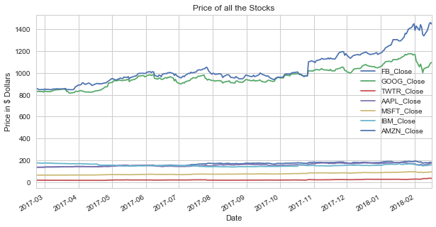

**Moving Average**

Moving Averages of 10,20,30,40,50,60,70,80,90 and 100 days have been calculated for all the technical stocks in the portfolio.

   1) Moving average of Apple stock price.

```python
moving_avg_day = [10,20,30,40,50,60,70,80,90,100]
    
for x in moving_avg_day:
    column_name = "MA for %s days" %(str(x))
    AAPL[column_name] = pd.rolling_mean(AAPL['Adj Close'],x)

AAPL[['Adj Close','MA for 10 days','MA for 20 days','MA for 30 days','MA for 40 days','MA for 50 days','MA for 60 days','MA for 70 days','MA for 80 days','MA for 90 days','MA for 100 days']].plot(figsize=(10,5))
plt.title( 'Moving Average Of Apple for 10,20,30,40,50,60,70,80,90,100 days')
plt.xlabel('Date')
plt.ylabel('Price in $ Dollars')
```
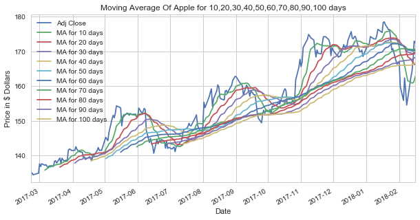

   2) Moving average of Facebook stock price.

```python
moving_avg_day = [10,20,30,40,50,60,70,80,90,100]
    
for x in moving_avg_day:
    column_name = "MA for %s days" %(str(x))
    FB[column_name] = pd.rolling_mean(FB['Adj Close'],x)

FB[['Adj Close','MA for 10 days','MA for 20 days','MA for 30 days','MA for 40 days','MA for 50 days','MA for 60 days','MA for 70 days','MA for 80 days','MA for 90 days','MA for 100 days']].plot(figsize=(10,5))
plt.title( 'Moving Average Of Facebook for 10,20,30,40,50,60,70,80,90,100 days')
plt.xlabel('Date')
plt.ylabel('Price in $ Dollars')
```
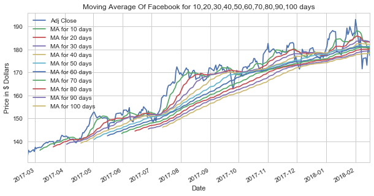

   3) Moving average of Microsoft stock price.

```python
moving_avg_day = [10,20,30,40,50,60,70,80,90,100]
    
for x in moving_avg_day:
    column_name = "MA for %s days" %(str(x))
    MSFT[column_name] = pd.rolling_mean(MSFT['Adj Close'],x)

MSFT[['Adj Close','MA for 10 days','MA for 20 days','MA for 30 days','MA for 40 days','MA for 50 days','MA for 60 days','MA for 70 days','MA for 80 days','MA for 90 days','MA for 100 days']].plot(figsize=(10,5))
plt.title( 'Moving Average Of Microsoft for 10,20,30,40,50,60,70,80,90,100 days')
plt.xlabel('Date')
plt.ylabel('Price in $ Dollars')
```
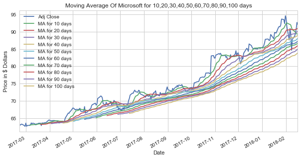

   4) Moving average of Google stock price.

```python
moving_avg_day = [10,20,30,40,50,60,70,80,90,100]
    
for x in moving_avg_day:
    column_name = "MA for %s days" %(str(x))
    GOOG[column_name] = pd.rolling_mean(GOOG['Adj Close'],x)

GOOG[['Adj Close','MA for 10 days','MA for 20 days','MA for 30 days','MA for 40 days','MA for 50 days','MA for 60 days','MA for 70 days','MA for 80 days','MA for 90 days','MA for 100 days']].plot(figsize=(10,5))
plt.title( 'Moving Average Of Google for 10,20,30,40,50,60,70,80,90,100 days')
plt.xlabel('Date')
plt.ylabel('Price in $ Dollars')
```
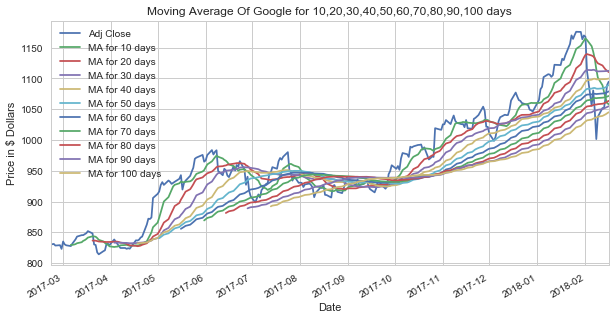

   5) Moving average of Twitter stock price.

```python
moving_avg_day = [10,20,30,40,50,60,70,80,90,100]
    
for x in moving_avg_day:
    column_name = "MA for %s days" %(str(x))
    TWTR[column_name] = pd.rolling_mean(TWTR['Adj Close'],x)

TWTR[['Adj Close','MA for 10 days','MA for 20 days','MA for 30 days','MA for 40 days','MA for 50 days','MA for 60 days','MA for 70 days','MA for 80 days','MA for 90 days','MA for 100 days']].plot(figsize=(10,5))
plt.title( 'Moving Average Of Twitter for 10,20,30,40,50,60,70,80,90,100 days')
plt.xlabel('Date')
plt.ylabel('Price in $ Dollars')
```
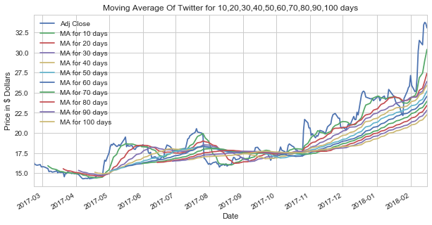

   6) Moving average of Amazon stock price.

```python
moving_avg_day = [10,20,30,40,50,60,70,80,90,100]
    
for x in moving_avg_day:
    column_name = "MA for %s days" %(str(x))
    AMZN[column_name] = pd.rolling_mean(AMZN['Adj Close'],x)

AMZN[['Adj Close','MA for 10 days','MA for 20 days','MA for 30 days','MA for 40 days','MA for 50 days','MA for 60 days','MA for 70 days','MA for 80 days','MA for 90 days','MA for 100 days']].plot(figsize=(10,5))
plt.title( 'Moving Average Of Amazon for 10,20,30,40,50,60,70,80,90,100 days')
plt.xlabel('Date')
plt.ylabel('Price in $ Dollars')
```
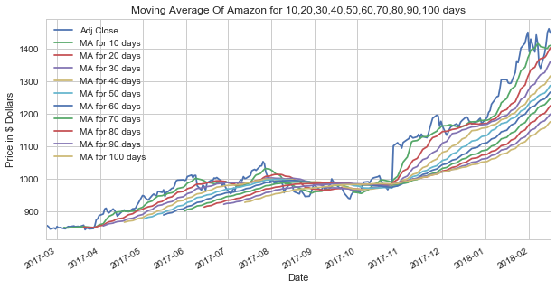

   7) Moving average of IBM stock price.

```python
moving_avg_day = [10,20,30,40,50,60,70,80,90,100]
    
for x in moving_avg_day:
    column_name = "MA for %s days" %(str(x))
    IBM[column_name] = pd.rolling_mean(IBM['Adj Close'],x)

IBM[['Adj Close','MA for 10 days','MA for 20 days','MA for 30 days','MA for 40 days','MA for 50 days','MA for 60 days','MA for 70 days','MA for 80 days','MA for 90 days','MA for 100 days']].plot(figsize=(10,5))
plt.title( 'Moving Average Of IBM for 10,20,30,40,50,60,70,80,90,100 days')
plt.xlabel('Date')
plt.ylabel('Price in $ Dollars')
```
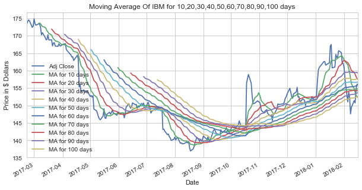

Moving Average Ribbon technique has been used to identify the changing trends in the stock prices.
When the all the moving averages are moving upwards then it signifies an upward trend and when downwards it signifies a downward trend.

The presence of fewer death crosses also tells us that most of the time the trend has been upward but sometimes trend got reversed ( in case of  IBM stock price) too.

**Normalization**

Price of the stocks have been normalized and then been plotted to compare the volatility.

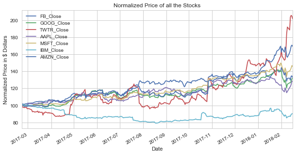

The help of Heat map and pair plot have been taken in order to do see how every other stocks are related to each other. Since we are comparing oranges with oranges or apples with apples henceforth we would like to see how they are coorelated to each other.

This comparison has been done in 2 ways.

1) Pair plot and heat map of the Adj Close price
2) Pair plot and heat map of the combined tech price

**1) Pair plot and heat map of the Adj Close price**

```python
sns.pairplot(combine_close)

corr=combine_close.corr()
plt.figure(figsize=(10, 7))

sns.heatmap(corr, 
            vmax=.8, 
            linewidths=0.01,
            square=True,
            annot=True,
            cmap='Blues',
            linecolor="lightblue")
plt.title('Correlation between Different Stocks Closing Price');
```

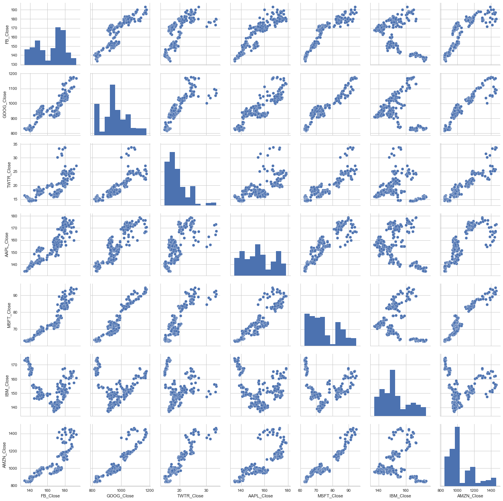


**2) Pair plot and heat map of the combined tech price**

```python
combine_tech_returns = combine_close.pct_change().dropna()

sns.pairplot(combine_tech_returns)

corr=combine_tech_returns.corr()
plt.figure(figsize=(10, 7))

sns.heatmap(corr, 
            vmax=.8, 
            linewidths=0.01,
            square=True,
            annot=True,
            cmap='Blues',
            linecolor="lightblue")
plt.title('Correlation between Different Stocks Return');
```

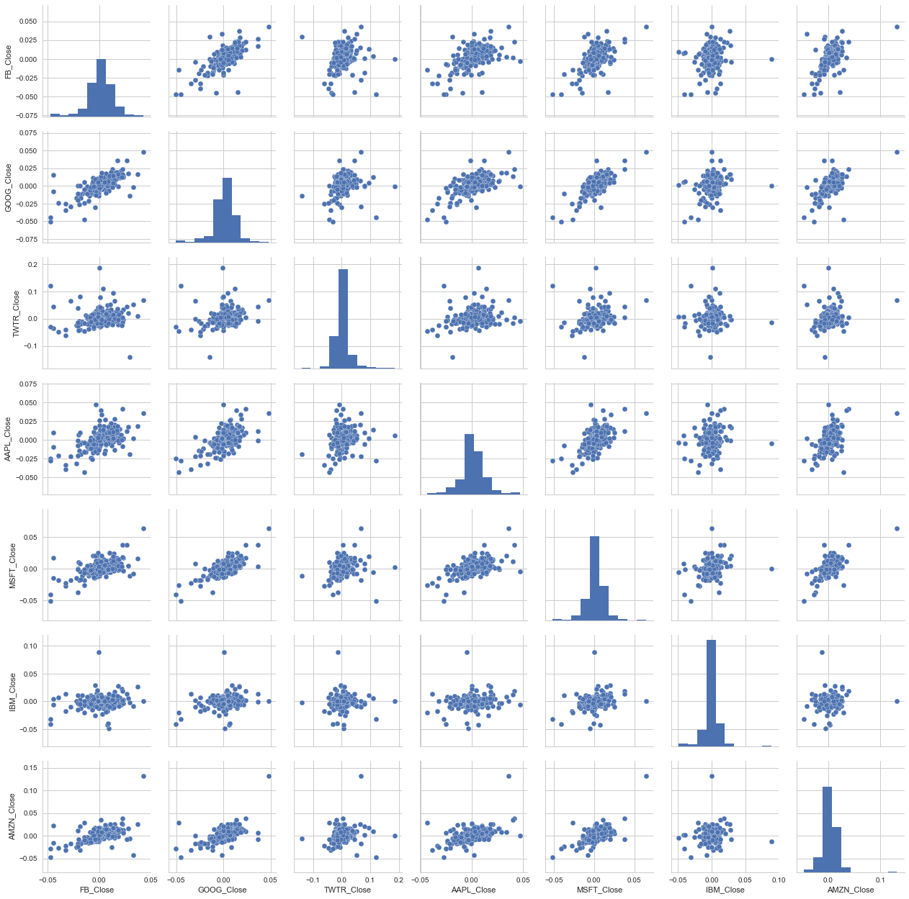

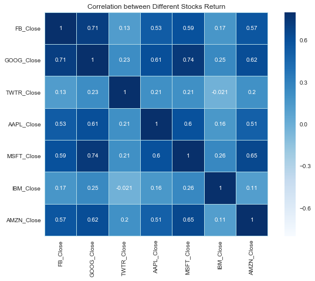

After analyzing both the cases it is found that

1) for the adj close price of the shares, IBM's stock price is negatively correlated with the rest of the stock prices.
2) for the return of the shares, stock prices of Twitter and IBM have small positive correlation with the rest of the stock prices.
3) Stock prices of Twitter and IBM are negtively correlated to each other.

Below is the plot of the normal distribution of several stock prices. From the below graph it can be clearly concluded that stock price of twitter has got more variation in its price as its bell curve is widely spread and it has a small kurtosis.

```python
import seaborn as sns
import matplotlib.pyplot as plt
sns.set_style('whitegrid')
plt.figure(figsize=(15, 6))

ax1 = combine_tech_returns['FB_Close'].plot(kind='kde')
ax2 = combine_tech_returns['GOOG_Close'].plot(kind='kde')
ax3 = combine_tech_returns['TWTR_Close'].plot(kind='kde')
ax4 = combine_tech_returns['AAPL_Close'].plot(kind='kde')
ax5 = combine_tech_returns['MSFT_Close'].plot(kind='kde')
ax6 = combine_tech_returns['IBM_Close'].plot(kind='kde')
ax7 = combine_tech_returns['AMZN_Close'].plot(kind='kde')

ax1.set_xlim([-0.1,0.1])
ax2.set_xlim([-0.1,0.1])
ax3.set_xlim([-0.1,0.1])
ax4.set_xlim([-0.1,0.1])
ax5.set_xlim([-0.1,0.1])
ax6.set_xlim([-0.1,0.1])
ax7.set_xlim([-0.1,0.1])

plt.xlabel("Stock return in percentage change")    
plt.title("Kernel density estimation of the stock returns")

plt.legend(('FB_Close','GOOG_Close','TWTR_Close','AAPL_Close','MSFT_Close','IBM_Close','AMZN_Close'),loc='best') ;
```
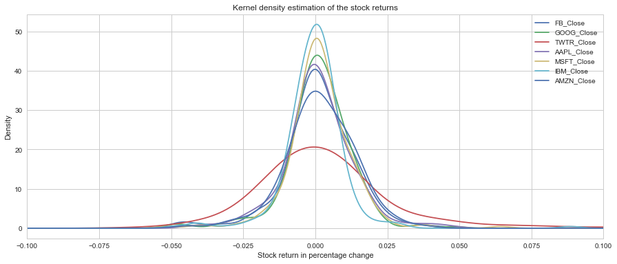

**Plot of Daily Return of Twitter**

```python
log_returns_TWTR = np.log( 1 + TWTR['Adj Close'].pct_change()) 
log_returns_TWTR.plot(legend=True,figsize=(12,5),linestyle='--',marker='o')
```
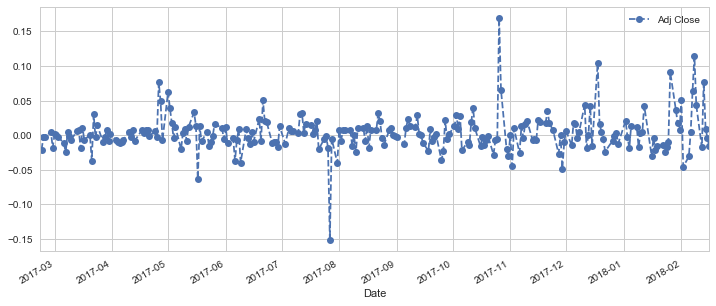

**Monte Carlo Simulation of Twitter Future Stock Price**

Monte carlo simulation is a popular way to estimate the range of the price of any stock price.

```python
S0_TWTR = TWTR['Adj Close'].iloc[-1]
S0_TWTR # Start Price

    33.060001
```

Since the share price of Twitter fluctuated the most amongst other stocks hence we can say that the price of Twitter is somewhat volatile. So let us try to predict the future price of Twitter.

In order to predict the price, we will take the help of Monte Carlo Simulation to speculate the mean price over a given period of time and the variance. The word “Stocks” itself is a riddle wrapped up in mystery. The price of Shares is completely unpredictable in every possible sense. When forecasting any event is riddled with uncertainty, future price value cannot be determined specifically, then Monte Carlo Simulation comes handy.

We can derive the present price of stocks on the basis of the past price using the equation:

Price Today = Price Yesterday * e^r. 

r is the randomness here. r is the sum of two parameters: **1) Drift and 2) Volatility.**
Drift and volatility both can be calculated using standard deviation, days and iterations.
    
   **PT1 = Price of Today, PT0 = Price of Yesterday**
   
   ***PT1 = PT0 * e^[Drift+ Volatility]***

We can implement the above formula using python while reiterating (1000 iterations) the future price of Twitter for a given period of time (in this case its 30 days).

```python
from scipy.stats import norm
days = 30
iterations = 1000

u = log_returns_TWTR.mean()
var = log_returns_TWTR.var()
drift = u - (0.5*var)
stdev = log_returns_TWTR.std()
type(drift), type(stdev)
drift, stdev
np.array(drift)
norm.ppf(0.95)

def monte_carlo_TWTR(days,iterations,drift,stdev):

    daily_returns_TWTR = np.exp(drift + stdev * norm.ppf(np.random.rand(days, iterations)))
    
    #norm.ppf(np.random.rand(days, iterations)) -> Z -> Corresponds to the distance between the mean and the events, 
    #expressed as the number of standard deviations
    S0_TWTR = TWTR['Adj Close'].iloc[-1]
    S0_TWTR # Start Price
    price_list = np.zeros_like(daily_returns_TWTR)
    price_list[0] = S0_TWTR

    for t in range(1, days):
        price_list[t] = price_list[t-1] * daily_returns_TWTR[t]
    return price_list


plt.figure(figsize=(13,6))
#plt.plot(price_list)
plt.plot(monte_carlo_TWTR(days,iterations,drift,stdev))
plt.xlabel('Days')
plt.ylabel('Twitter Price in $ Dollars')
plt.figtext(0.3,0.8, s="Number of Iterations :%.0f" %iterations)
plt.figtext(0.3,0.75, s="Number of Days :%.0f" %days)
plt.title( u"Monte Carlo Simulation Analysis of Twitter for %s days" % days, weight='bold')
```

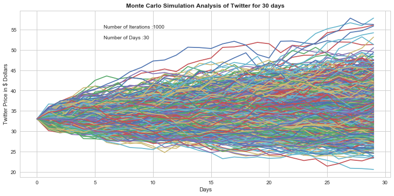

```python
from sklearn.preprocessing import OneHotEncoder
runs = 10000
simulations_TWTR = np.zeros(runs)

for run in xrange(runs):
   simulations_TWTR = monte_carlo_TWTR(days,iterations,drift,stdev)[days -1]
```


```python
q = np.percentile(simulations_TWTR,1)

plt.figure(figsize=(7,5))

plt.hist(simulations_TWTR,bins=100,color='lightblue')
plt.figtext(0.6,0.8, s="Start price: $%.2f" %S0_TWTR)
plt.figtext(0.6,0.75, "Mean final price: $%.2f" %simulations_TWTR.mean())
plt.figtext(0.6,0.7,"VaR(0.99): $%.2f" %(S0_TWTR - q,))
plt.figtext(0.6,0.65,"q(0.99): $%.2f" %q)
plt.axvline(x=q, linewidth=4, color='red')
plt.title(u"Final price distribution for Twitter Share after %s days" % days, weight='bold');
```

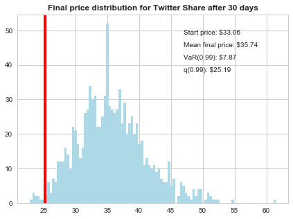

As per the above price distribution, we can say that the mean price of Twitter would hover around 35.74 USD by mid-March 2018. The variance is 7.87 USD which means that 99 percent of the time the maximum amount one can lose on Twitter is 7.87 USD.

