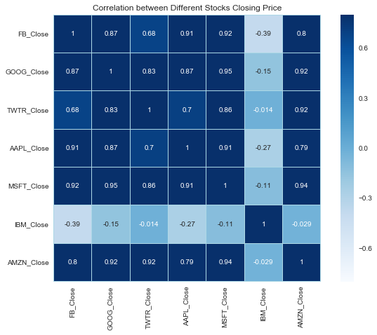

```python
import numpy as np
import pandas as pd
import seaborn as sns
import matplotlib.pyplot as plt
from pandas_datareader import data as wb
from __future__ import division
from pandas import Series,DataFrame
sns.set_style('whitegrid')
%matplotlib inline
```


```python
from datetime import datetime
stocks_tech_list = ['FB','GOOG','TWTR','AAPL','MSFT','IBM','AMZN']
end = datetime.now()
start = datetime(end.year-1,end.month,end.day)
```


```python
for x in stocks_tech_list:
    globals()[x] = wb.DataReader(x,'yahoo',start,end)
```


```python
combine_close = pd.concat([FB['Adj Close'],GOOG['Adj Close'],TWTR['Adj Close'],AAPL['Adj Close'],MSFT['Adj Close'],IBM['Adj Close'],AMZN['Adj Close']],axis=1)
combine_close.columns = ['FB_Close','GOOG_Close','TWTR_Close','AAPL_Close','MSFT_Close','IBM_Close','AMZN_Close']
combine_close.head()
```


<div>
<style>
    .dataframe thead tr:only-child th {
        text-align: right;
    }

    .dataframe thead th {
        text-align: left;
    }

    .dataframe tbody tr th {
        vertical-align: top;
    }
</style>
<table border="1" class="dataframe">
  <thead>
    <tr style="text-align: right;">
      <th></th>
      <th>FB_Close</th>
      <th>GOOG_Close</th>
      <th>TWTR_Close</th>
      <th>AAPL_Close</th>
      <th>MSFT_Close</th>
      <th>IBM_Close</th>
      <th>AMZN_Close</th>
    </tr>
    <tr>
      <th>Date</th>
      <th></th>
      <th></th>
      <th></th>
      <th></th>
      <th></th>
      <th></th>
      <th></th>
    </tr>
  </thead>
  <tbody>
    <tr>
      <th>2017-02-21</th>
      <td>133.720001</td>
      <td>831.659973</td>
      <td>16.420000</td>
      <td>134.571167</td>
      <td>63.167179</td>
      <td>173.196243</td>
      <td>856.440002</td>
    </tr>
    <tr>
      <th>2017-02-22</th>
      <td>136.119995</td>
      <td>830.760010</td>
      <td>16.080000</td>
      <td>134.974762</td>
      <td>63.039845</td>
      <td>174.051376</td>
      <td>855.609985</td>
    </tr>
    <tr>
      <th>2017-02-23</th>
      <td>135.360001</td>
      <td>831.330017</td>
      <td>16.030001</td>
      <td>134.403809</td>
      <td>63.294514</td>
      <td>174.531784</td>
      <td>852.190002</td>
    </tr>
    <tr>
      <th>2017-02-24</th>
      <td>135.440002</td>
      <td>828.640015</td>
      <td>15.980000</td>
      <td>134.531784</td>
      <td>63.294514</td>
      <td>174.243530</td>
      <td>845.239990</td>
    </tr>
    <tr>
      <th>2017-02-27</th>
      <td>136.410004</td>
      <td>829.280029</td>
      <td>16.059999</td>
      <td>134.797562</td>
      <td>62.912518</td>
      <td>172.369965</td>
      <td>848.640015</td>
    </tr>
  </tbody>
</table>
</div>


```python
combine_close.plot(legend=True,figsize=(10,5))
plt.xlabel('Date')
plt.ylabel('Price in $ Dollars')
plt.title( 'Price of all the Stocks')
```


    <matplotlib.text.Text at 0x1099cd68>


```python
moving_avg_day = [10,20,30,40,50,60,70,80,90,100]
    
for x in moving_avg_day:
    column_name = "MA for %s days" %(str(x))
    AAPL[column_name] = pd.rolling_mean(AAPL['Adj Close'],x)

AAPL[['Adj Close','MA for 10 days','MA for 20 days','MA for 30 days','MA for 40 days','MA for 50 days','MA for 60 days','MA for 70 days','MA for 80 days','MA for 90 days','MA for 100 days']].plot(figsize=(10,5))
plt.title( 'Moving Average Of Apple for 10,20,30,40,50,60,70,80,90,100 days')
plt.xlabel('Date')
plt.ylabel('Price in $ Dollars')
```

    C:\Users\admin\Anaconda2\lib\site-packages\ipykernel_launcher.py:5: FutureWarning: pd.rolling_mean is deprecated for Series and will be removed in a future version, replace with 
    	Series.rolling(window=10,center=False).mean()
      """
    C:\Users\admin\Anaconda2\lib\site-packages\ipykernel_launcher.py:5: FutureWarning: pd.rolling_mean is deprecated for Series and will be removed in a future version, replace with 
    	Series.rolling(window=20,center=False).mean()
      """
    C:\Users\admin\Anaconda2\lib\site-packages\ipykernel_launcher.py:5: FutureWarning: pd.rolling_mean is deprecated for Series and will be removed in a future version, replace with 
    	Series.rolling(window=30,center=False).mean()
      """
    C:\Users\admin\Anaconda2\lib\site-packages\ipykernel_launcher.py:5: FutureWarning: pd.rolling_mean is deprecated for Series and will be removed in a future version, replace with 
    	Series.rolling(window=40,center=False).mean()
      """
    C:\Users\admin\Anaconda2\lib\site-packages\ipykernel_launcher.py:5: FutureWarning: pd.rolling_mean is deprecated for Series and will be removed in a future version, replace with 
    	Series.rolling(window=50,center=False).mean()
      """
    C:\Users\admin\Anaconda2\lib\site-packages\ipykernel_launcher.py:5: FutureWarning: pd.rolling_mean is deprecated for Series and will be removed in a future version, replace with 
    	Series.rolling(window=60,center=False).mean()
      """
    C:\Users\admin\Anaconda2\lib\site-packages\ipykernel_launcher.py:5: FutureWarning: pd.rolling_mean is deprecated for Series and will be removed in a future version, replace with 
    	Series.rolling(window=70,center=False).mean()
      """
    C:\Users\admin\Anaconda2\lib\site-packages\ipykernel_launcher.py:5: FutureWarning: pd.rolling_mean is deprecated for Series and will be removed in a future version, replace with 
    	Series.rolling(window=80,center=False).mean()
      """
    C:\Users\admin\Anaconda2\lib\site-packages\ipykernel_launcher.py:5: FutureWarning: pd.rolling_mean is deprecated for Series and will be removed in a future version, replace with 
    	Series.rolling(window=90,center=False).mean()
      """
    C:\Users\admin\Anaconda2\lib\site-packages\ipykernel_launcher.py:5: FutureWarning: pd.rolling_mean is deprecated for Series and will be removed in a future version, replace with 
    	Series.rolling(window=100,center=False).mean()
      """
    


    <matplotlib.text.Text at 0xde02710>


```python
moving_avg_day = [10,20,30,40,50,60,70,80,90,100]
    
for x in moving_avg_day:
    column_name = "MA for %s days" %(str(x))
    FB[column_name] = pd.rolling_mean(FB['Adj Close'],x)

FB[['Adj Close','MA for 10 days','MA for 20 days','MA for 30 days','MA for 40 days','MA for 50 days','MA for 60 days','MA for 70 days','MA for 80 days','MA for 90 days','MA for 100 days']].plot(figsize=(10,5))
plt.title( 'Moving Average Of Facebook for 10,20,30,40,50,60,70,80,90,100 days')
plt.xlabel('Date')
plt.ylabel('Price in $ Dollars')
```

    C:\Users\admin\Anaconda2\lib\site-packages\ipykernel_launcher.py:5: FutureWarning: pd.rolling_mean is deprecated for Series and will be removed in a future version, replace with 
    	Series.rolling(window=10,center=False).mean()
      """
    C:\Users\admin\Anaconda2\lib\site-packages\ipykernel_launcher.py:5: FutureWarning: pd.rolling_mean is deprecated for Series and will be removed in a future version, replace with 
    	Series.rolling(window=20,center=False).mean()
      """
    C:\Users\admin\Anaconda2\lib\site-packages\ipykernel_launcher.py:5: FutureWarning: pd.rolling_mean is deprecated for Series and will be removed in a future version, replace with 
    	Series.rolling(window=30,center=False).mean()
      """
    C:\Users\admin\Anaconda2\lib\site-packages\ipykernel_launcher.py:5: FutureWarning: pd.rolling_mean is deprecated for Series and will be removed in a future version, replace with 
    	Series.rolling(window=40,center=False).mean()
      """
    C:\Users\admin\Anaconda2\lib\site-packages\ipykernel_launcher.py:5: FutureWarning: pd.rolling_mean is deprecated for Series and will be removed in a future version, replace with 
    	Series.rolling(window=50,center=False).mean()
      """
    C:\Users\admin\Anaconda2\lib\site-packages\ipykernel_launcher.py:5: FutureWarning: pd.rolling_mean is deprecated for Series and will be removed in a future version, replace with 
    	Series.rolling(window=60,center=False).mean()
      """
    C:\Users\admin\Anaconda2\lib\site-packages\ipykernel_launcher.py:5: FutureWarning: pd.rolling_mean is deprecated for Series and will be removed in a future version, replace with 
    	Series.rolling(window=70,center=False).mean()
      """
    C:\Users\admin\Anaconda2\lib\site-packages\ipykernel_launcher.py:5: FutureWarning: pd.rolling_mean is deprecated for Series and will be removed in a future version, replace with 
    	Series.rolling(window=80,center=False).mean()
      """
    C:\Users\admin\Anaconda2\lib\site-packages\ipykernel_launcher.py:5: FutureWarning: pd.rolling_mean is deprecated for Series and will be removed in a future version, replace with 
    	Series.rolling(window=90,center=False).mean()
      """
    C:\Users\admin\Anaconda2\lib\site-packages\ipykernel_launcher.py:5: FutureWarning: pd.rolling_mean is deprecated for Series and will be removed in a future version, replace with 
    	Series.rolling(window=100,center=False).mean()
      """
    


    <matplotlib.text.Text at 0xe2c9128>


```python
moving_avg_day = [10,20,30,40,50,60,70,80,90,100]
    
for x in moving_avg_day:
    column_name = "MA for %s days" %(str(x))
    MSFT[column_name] = pd.rolling_mean(MSFT['Adj Close'],x)

MSFT[['Adj Close','MA for 10 days','MA for 20 days','MA for 30 days','MA for 40 days','MA for 50 days','MA for 60 days','MA for 70 days','MA for 80 days','MA for 90 days','MA for 100 days']].plot(figsize=(10,5))
plt.title( 'Moving Average Of Microsoft for 10,20,30,40,50,60,70,80,90,100 days')
plt.xlabel('Date')
plt.ylabel('Price in $ Dollars')
```

    C:\Users\admin\Anaconda2\lib\site-packages\ipykernel_launcher.py:5: FutureWarning: pd.rolling_mean is deprecated for Series and will be removed in a future version, replace with 
    	Series.rolling(window=10,center=False).mean()
      """
    C:\Users\admin\Anaconda2\lib\site-packages\ipykernel_launcher.py:5: FutureWarning: pd.rolling_mean is deprecated for Series and will be removed in a future version, replace with 
    	Series.rolling(window=20,center=False).mean()
      """
    C:\Users\admin\Anaconda2\lib\site-packages\ipykernel_launcher.py:5: FutureWarning: pd.rolling_mean is deprecated for Series and will be removed in a future version, replace with 
    	Series.rolling(window=30,center=False).mean()
      """
    C:\Users\admin\Anaconda2\lib\site-packages\ipykernel_launcher.py:5: FutureWarning: pd.rolling_mean is deprecated for Series and will be removed in a future version, replace with 
    	Series.rolling(window=40,center=False).mean()
      """
    C:\Users\admin\Anaconda2\lib\site-packages\ipykernel_launcher.py:5: FutureWarning: pd.rolling_mean is deprecated for Series and will be removed in a future version, replace with 
    	Series.rolling(window=50,center=False).mean()
      """
    C:\Users\admin\Anaconda2\lib\site-packages\ipykernel_launcher.py:5: FutureWarning: pd.rolling_mean is deprecated for Series and will be removed in a future version, replace with 
    	Series.rolling(window=60,center=False).mean()
      """
    C:\Users\admin\Anaconda2\lib\site-packages\ipykernel_launcher.py:5: FutureWarning: pd.rolling_mean is deprecated for Series and will be removed in a future version, replace with 
    	Series.rolling(window=70,center=False).mean()
      """
    C:\Users\admin\Anaconda2\lib\site-packages\ipykernel_launcher.py:5: FutureWarning: pd.rolling_mean is deprecated for Series and will be removed in a future version, replace with 
    	Series.rolling(window=80,center=False).mean()
      """
    C:\Users\admin\Anaconda2\lib\site-packages\ipykernel_launcher.py:5: FutureWarning: pd.rolling_mean is deprecated for Series and will be removed in a future version, replace with 
    	Series.rolling(window=90,center=False).mean()
      """
    C:\Users\admin\Anaconda2\lib\site-packages\ipykernel_launcher.py:5: FutureWarning: pd.rolling_mean is deprecated for Series and will be removed in a future version, replace with 
    	Series.rolling(window=100,center=False).mean()
      """
    


    <matplotlib.text.Text at 0xf3e51d0>


```python
moving_avg_day = [10,20,30,40,50,60,70,80,90,100]
    
for x in moving_avg_day:
    column_name = "MA for %s days" %(str(x))
    GOOG[column_name] = pd.rolling_mean(GOOG['Adj Close'],x)

GOOG[['Adj Close','MA for 10 days','MA for 20 days','MA for 30 days','MA for 40 days','MA for 50 days','MA for 60 days','MA for 70 days','MA for 80 days','MA for 90 days','MA for 100 days']].plot(figsize=(10,5))
plt.title( 'Moving Average Of Google for 10,20,30,40,50,60,70,80,90,100 days')
plt.xlabel('Date')
plt.ylabel('Price in $ Dollars')
```

    C:\Users\admin\Anaconda2\lib\site-packages\ipykernel_launcher.py:5: FutureWarning: pd.rolling_mean is deprecated for Series and will be removed in a future version, replace with 
    	Series.rolling(window=10,center=False).mean()
      """
    C:\Users\admin\Anaconda2\lib\site-packages\ipykernel_launcher.py:5: FutureWarning: pd.rolling_mean is deprecated for Series and will be removed in a future version, replace with 
    	Series.rolling(window=20,center=False).mean()
      """
    C:\Users\admin\Anaconda2\lib\site-packages\ipykernel_launcher.py:5: FutureWarning: pd.rolling_mean is deprecated for Series and will be removed in a future version, replace with 
    	Series.rolling(window=30,center=False).mean()
      """
    C:\Users\admin\Anaconda2\lib\site-packages\ipykernel_launcher.py:5: FutureWarning: pd.rolling_mean is deprecated for Series and will be removed in a future version, replace with 
    	Series.rolling(window=40,center=False).mean()
      """
    C:\Users\admin\Anaconda2\lib\site-packages\ipykernel_launcher.py:5: FutureWarning: pd.rolling_mean is deprecated for Series and will be removed in a future version, replace with 
    	Series.rolling(window=50,center=False).mean()
      """
    C:\Users\admin\Anaconda2\lib\site-packages\ipykernel_launcher.py:5: FutureWarning: pd.rolling_mean is deprecated for Series and will be removed in a future version, replace with 
    	Series.rolling(window=60,center=False).mean()
      """
    C:\Users\admin\Anaconda2\lib\site-packages\ipykernel_launcher.py:5: FutureWarning: pd.rolling_mean is deprecated for Series and will be removed in a future version, replace with 
    	Series.rolling(window=70,center=False).mean()
      """
    C:\Users\admin\Anaconda2\lib\site-packages\ipykernel_launcher.py:5: FutureWarning: pd.rolling_mean is deprecated for Series and will be removed in a future version, replace with 
    	Series.rolling(window=80,center=False).mean()
      """
    C:\Users\admin\Anaconda2\lib\site-packages\ipykernel_launcher.py:5: FutureWarning: pd.rolling_mean is deprecated for Series and will be removed in a future version, replace with 
    	Series.rolling(window=90,center=False).mean()
      """
    C:\Users\admin\Anaconda2\lib\site-packages\ipykernel_launcher.py:5: FutureWarning: pd.rolling_mean is deprecated for Series and will be removed in a future version, replace with 
    	Series.rolling(window=100,center=False).mean()
      """
    


    <matplotlib.text.Text at 0xf3d77f0>


```python
moving_avg_day = [10,20,30,40,50,60,70,80,90,100]
    
for x in moving_avg_day:
    column_name = "MA for %s days" %(str(x))
    TWTR[column_name] = pd.rolling_mean(TWTR['Adj Close'],x)

TWTR[['Adj Close','MA for 10 days','MA for 20 days','MA for 30 days','MA for 40 days','MA for 50 days','MA for 60 days','MA for 70 days','MA for 80 days','MA for 90 days','MA for 100 days']].plot(figsize=(10,5))
plt.title( 'Moving Average Of Twitter for 10,20,30,40,50,60,70,80,90,100 days')
plt.xlabel('Date')
plt.ylabel('Price in $ Dollars')
```

    C:\Users\admin\Anaconda2\lib\site-packages\ipykernel_launcher.py:5: FutureWarning: pd.rolling_mean is deprecated for Series and will be removed in a future version, replace with 
    	Series.rolling(window=10,center=False).mean()
      """
    C:\Users\admin\Anaconda2\lib\site-packages\ipykernel_launcher.py:5: FutureWarning: pd.rolling_mean is deprecated for Series and will be removed in a future version, replace with 
    	Series.rolling(window=20,center=False).mean()
      """
    C:\Users\admin\Anaconda2\lib\site-packages\ipykernel_launcher.py:5: FutureWarning: pd.rolling_mean is deprecated for Series and will be removed in a future version, replace with 
    	Series.rolling(window=30,center=False).mean()
      """
    C:\Users\admin\Anaconda2\lib\site-packages\ipykernel_launcher.py:5: FutureWarning: pd.rolling_mean is deprecated for Series and will be removed in a future version, replace with 
    	Series.rolling(window=40,center=False).mean()
      """
    C:\Users\admin\Anaconda2\lib\site-packages\ipykernel_launcher.py:5: FutureWarning: pd.rolling_mean is deprecated for Series and will be removed in a future version, replace with 
    	Series.rolling(window=50,center=False).mean()
      """
    C:\Users\admin\Anaconda2\lib\site-packages\ipykernel_launcher.py:5: FutureWarning: pd.rolling_mean is deprecated for Series and will be removed in a future version, replace with 
    	Series.rolling(window=60,center=False).mean()
      """
    C:\Users\admin\Anaconda2\lib\site-packages\ipykernel_launcher.py:5: FutureWarning: pd.rolling_mean is deprecated for Series and will be removed in a future version, replace with 
    	Series.rolling(window=70,center=False).mean()
      """
    C:\Users\admin\Anaconda2\lib\site-packages\ipykernel_launcher.py:5: FutureWarning: pd.rolling_mean is deprecated for Series and will be removed in a future version, replace with 
    	Series.rolling(window=80,center=False).mean()
      """
    C:\Users\admin\Anaconda2\lib\site-packages\ipykernel_launcher.py:5: FutureWarning: pd.rolling_mean is deprecated for Series and will be removed in a future version, replace with 
    	Series.rolling(window=90,center=False).mean()
      """
    C:\Users\admin\Anaconda2\lib\site-packages\ipykernel_launcher.py:5: FutureWarning: pd.rolling_mean is deprecated for Series and will be removed in a future version, replace with 
    	Series.rolling(window=100,center=False).mean()
      """
    


    <matplotlib.text.Text at 0xfb92748>


```python
moving_avg_day = [10,20,30,40,50,60,70,80,90,100]
    
for x in moving_avg_day:
    column_name = "MA for %s days" %(str(x))
    AMZN[column_name] = pd.rolling_mean(AMZN['Adj Close'],x)

AMZN[['Adj Close','MA for 10 days','MA for 20 days','MA for 30 days','MA for 40 days','MA for 50 days','MA for 60 days','MA for 70 days','MA for 80 days','MA for 90 days','MA for 100 days']].plot(figsize=(10,5))
plt.title( 'Moving Average Of Amazon for 10,20,30,40,50,60,70,80,90,100 days')
plt.xlabel('Date')
plt.ylabel('Price in $ Dollars')
```

    C:\Users\admin\Anaconda2\lib\site-packages\ipykernel_launcher.py:5: FutureWarning: pd.rolling_mean is deprecated for Series and will be removed in a future version, replace with 
    	Series.rolling(window=10,center=False).mean()
      """
    C:\Users\admin\Anaconda2\lib\site-packages\ipykernel_launcher.py:5: FutureWarning: pd.rolling_mean is deprecated for Series and will be removed in a future version, replace with 
    	Series.rolling(window=20,center=False).mean()
      """
    C:\Users\admin\Anaconda2\lib\site-packages\ipykernel_launcher.py:5: FutureWarning: pd.rolling_mean is deprecated for Series and will be removed in a future version, replace with 
    	Series.rolling(window=30,center=False).mean()
      """
    C:\Users\admin\Anaconda2\lib\site-packages\ipykernel_launcher.py:5: FutureWarning: pd.rolling_mean is deprecated for Series and will be removed in a future version, replace with 
    	Series.rolling(window=40,center=False).mean()
      """
    C:\Users\admin\Anaconda2\lib\site-packages\ipykernel_launcher.py:5: FutureWarning: pd.rolling_mean is deprecated for Series and will be removed in a future version, replace with 
    	Series.rolling(window=50,center=False).mean()
      """
    C:\Users\admin\Anaconda2\lib\site-packages\ipykernel_launcher.py:5: FutureWarning: pd.rolling_mean is deprecated for Series and will be removed in a future version, replace with 
    	Series.rolling(window=60,center=False).mean()
      """
    C:\Users\admin\Anaconda2\lib\site-packages\ipykernel_launcher.py:5: FutureWarning: pd.rolling_mean is deprecated for Series and will be removed in a future version, replace with 
    	Series.rolling(window=70,center=False).mean()
      """
    C:\Users\admin\Anaconda2\lib\site-packages\ipykernel_launcher.py:5: FutureWarning: pd.rolling_mean is deprecated for Series and will be removed in a future version, replace with 
    	Series.rolling(window=80,center=False).mean()
      """
    C:\Users\admin\Anaconda2\lib\site-packages\ipykernel_launcher.py:5: FutureWarning: pd.rolling_mean is deprecated for Series and will be removed in a future version, replace with 
    	Series.rolling(window=90,center=False).mean()
      """
    C:\Users\admin\Anaconda2\lib\site-packages\ipykernel_launcher.py:5: FutureWarning: pd.rolling_mean is deprecated for Series and will be removed in a future version, replace with 
    	Series.rolling(window=100,center=False).mean()
      """
    


    <matplotlib.text.Text at 0xff2a160>


```python
moving_avg_day = [10,20,30,40,50,60,70,80,90,100]
    
for x in moving_avg_day:
    column_name = "MA for %s days" %(str(x))
    IBM[column_name] = pd.rolling_mean(IBM['Adj Close'],x)

IBM[['Adj Close','MA for 10 days','MA for 20 days','MA for 30 days','MA for 40 days','MA for 50 days','MA for 60 days','MA for 70 days','MA for 80 days','MA for 90 days','MA for 100 days']].plot(figsize=(10,5))
plt.title( 'Moving Average Of IBM for 10,20,30,40,50,60,70,80,90,100 days')
plt.xlabel('Date')
plt.ylabel('Price in $ Dollars')
```

    C:\Users\admin\Anaconda2\lib\site-packages\ipykernel_launcher.py:5: FutureWarning: pd.rolling_mean is deprecated for Series and will be removed in a future version, replace with 
    	Series.rolling(window=10,center=False).mean()
      """
    C:\Users\admin\Anaconda2\lib\site-packages\ipykernel_launcher.py:5: FutureWarning: pd.rolling_mean is deprecated for Series and will be removed in a future version, replace with 
    	Series.rolling(window=20,center=False).mean()
      """
    C:\Users\admin\Anaconda2\lib\site-packages\ipykernel_launcher.py:5: FutureWarning: pd.rolling_mean is deprecated for Series and will be removed in a future version, replace with 
    	Series.rolling(window=30,center=False).mean()
      """
    C:\Users\admin\Anaconda2\lib\site-packages\ipykernel_launcher.py:5: FutureWarning: pd.rolling_mean is deprecated for Series and will be removed in a future version, replace with 
    	Series.rolling(window=40,center=False).mean()
      """
    C:\Users\admin\Anaconda2\lib\site-packages\ipykernel_launcher.py:5: FutureWarning: pd.rolling_mean is deprecated for Series and will be removed in a future version, replace with 
    	Series.rolling(window=50,center=False).mean()
      """
    C:\Users\admin\Anaconda2\lib\site-packages\ipykernel_launcher.py:5: FutureWarning: pd.rolling_mean is deprecated for Series and will be removed in a future version, replace with 
    	Series.rolling(window=60,center=False).mean()
      """
    C:\Users\admin\Anaconda2\lib\site-packages\ipykernel_launcher.py:5: FutureWarning: pd.rolling_mean is deprecated for Series and will be removed in a future version, replace with 
    	Series.rolling(window=70,center=False).mean()
      """
    C:\Users\admin\Anaconda2\lib\site-packages\ipykernel_launcher.py:5: FutureWarning: pd.rolling_mean is deprecated for Series and will be removed in a future version, replace with 
    	Series.rolling(window=80,center=False).mean()
      """
    C:\Users\admin\Anaconda2\lib\site-packages\ipykernel_launcher.py:5: FutureWarning: pd.rolling_mean is deprecated for Series and will be removed in a future version, replace with 
    	Series.rolling(window=90,center=False).mean()
      """
    C:\Users\admin\Anaconda2\lib\site-packages\ipykernel_launcher.py:5: FutureWarning: pd.rolling_mean is deprecated for Series and will be removed in a future version, replace with 
    	Series.rolling(window=100,center=False).mean()
      """
    


    <matplotlib.text.Text at 0x10318e48>


```python
(combine_close/combine_close.iloc[0]*100).plot(legend=True,figsize=(10,5))
#plt.show()
plt.xlabel('Date')
plt.ylabel('Normalized Price in $ Dollars')
plt.title( 'Normalized Price of all the Stocks')
```


    <matplotlib.text.Text at 0x113b6940>


```python
sns.pairplot(combine_close)


corr=combine_close.corr()
plt.figure(figsize=(10, 7))

sns.heatmap(corr, 
            vmax=.8, 
            linewidths=0.01,
            square=True,
            annot=True,
            cmap='Blues',
            linecolor="lightblue")
plt.title('Correlation between Different Stocks Closing Price');
```





```python
combine_tech_returns = combine_close.pct_change().dropna()

sns.pairplot(combine_tech_returns)

corr=combine_tech_returns.corr()
plt.figure(figsize=(10, 7))

sns.heatmap(corr, 
            vmax=.8, 
            linewidths=0.01,
            square=True,
            annot=True,
            cmap='Blues',
            linecolor="lightblue")
plt.title('Correlation between Different Stocks Return');
```


```python
import seaborn as sns
import matplotlib.pyplot as plt
sns.set_style('whitegrid')
plt.figure(figsize=(15, 6))

ax1 = combine_tech_returns['FB_Close'].plot(kind='kde')
ax2 = combine_tech_returns['GOOG_Close'].plot(kind='kde')
ax3 = combine_tech_returns['TWTR_Close'].plot(kind='kde')
ax4 = combine_tech_returns['AAPL_Close'].plot(kind='kde')
ax5 = combine_tech_returns['MSFT_Close'].plot(kind='kde')
ax6 = combine_tech_returns['IBM_Close'].plot(kind='kde')
ax7 = combine_tech_returns['AMZN_Close'].plot(kind='kde')

ax1.set_xlim([-0.1,0.1])
ax2.set_xlim([-0.1,0.1])
ax3.set_xlim([-0.1,0.1])
ax4.set_xlim([-0.1,0.1])
ax5.set_xlim([-0.1,0.1])
ax6.set_xlim([-0.1,0.1])
ax7.set_xlim([-0.1,0.1])

plt.xlabel("Stock return in percentage change")    
plt.title("Kernel density estimation of the stock returns")

plt.legend(('FB_Close','GOOG_Close','TWTR_Close','AAPL_Close','MSFT_Close','IBM_Close','AMZN_Close'),loc='best') ;
```


```python
log_returns_TWTR = np.log( 1 + TWTR['Adj Close'].pct_change()) 
log_returns_TWTR.plot(legend=True,figsize=(12,5),linestyle='--',marker='o')
```


    <matplotlib.axes._subplots.AxesSubplot at 0x14a1e198>


```python
S0_TWTR = TWTR['Adj Close'].iloc[-1]
S0_TWTR # Start Price
```


    33.060001


```python
from scipy.stats import norm
days = 30
iterations = 1000

u = log_returns_TWTR.mean()
var = log_returns_TWTR.var()
drift = u - (0.5*var)
stdev = log_returns_TWTR.std()
type(drift), type(stdev)
drift, stdev
np.array(drift)
norm.ppf(0.95)

def monte_carlo_TWTR(days,iterations,drift,stdev):

    daily_returns_TWTR = np.exp(drift + stdev * norm.ppf(np.random.rand(days, iterations)))
    
    #norm.ppf(np.random.rand(days, iterations)) -> Z -> Corresponds to the distance between the mean and the events, 
    #expressed as the number of standard deviations
    S0_TWTR = TWTR['Adj Close'].iloc[-1]
    S0_TWTR # Start Price
    price_list = np.zeros_like(daily_returns_TWTR)
    price_list[0] = S0_TWTR

    for t in range(1, days):
        price_list[t] = price_list[t-1] * daily_returns_TWTR[t]
    return price_list


plt.figure(figsize=(13,6))
#plt.plot(price_list)
plt.plot(monte_carlo_TWTR(days,iterations,drift,stdev))
plt.xlabel('Days')
plt.ylabel('Twitter Price in $ Dollars')
plt.figtext(0.3,0.8, s="Number of Iterations :%.0f" %iterations)
plt.figtext(0.3,0.75, s="Number of Days :%.0f" %days)
plt.title( u"Monte Carlo Simulation Analysis of Twitter for %s days" % days, weight='bold')
```


    <matplotlib.text.Text at 0x13a1ef28>


```python
from sklearn.preprocessing import OneHotEncoder
runs = 10000
simulations_TWTR = np.zeros(runs)

for run in xrange(runs):
    simulations_TWTR = monte_carlo_TWTR(days,iterations,drift,stdev)[days -1]
```


```python
q = np.percentile(simulations_TWTR,1)

plt.figure(figsize=(7,5))

plt.hist(simulations_TWTR,bins=100,color='lightblue')
plt.figtext(0.6,0.8, s="Start price: $%.2f" %S0_TWTR)
plt.figtext(0.6,0.75, "Mean final price: $%.2f" %simulations_TWTR.mean())
plt.figtext(0.6,0.7,"VaR(0.99): $%.2f" %(S0_TWTR - q,))
plt.figtext(0.6,0.65,"q(0.99): $%.2f" %q)
plt.axvline(x=q, linewidth=4, color='red')
plt.title(u"Final price distribution for Twitter Share after %s days" % days, weight='bold');
```


```python

```
